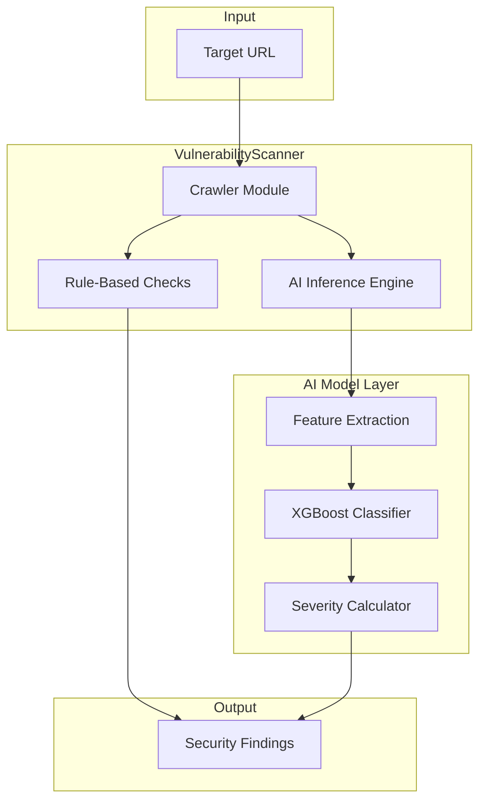
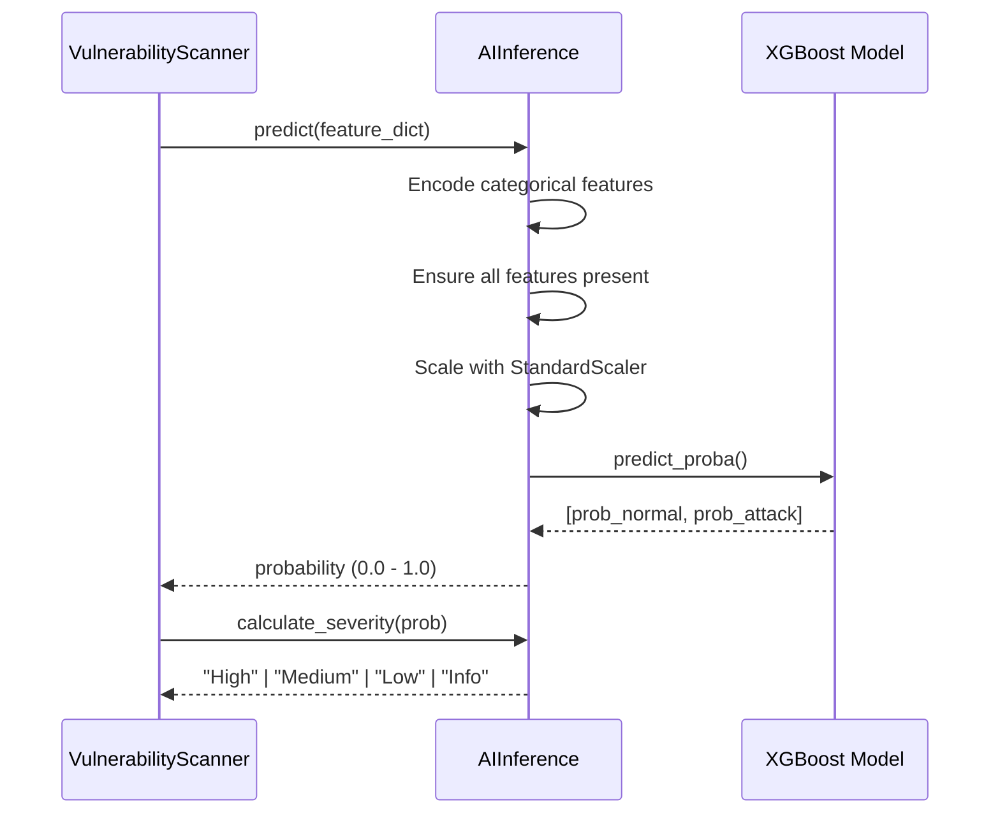

# AI Architecture Documentation

> A comprehensive technical guide to the AI-powered security scanning system used in this project.

## Overview

The project employs a **multi-layered AI security scanner** designed to detect malicious URLs and network intrusions. The architecture combines:

1. **Network Intrusion Detection System (NIDS)** - XGBoost classifier trained on UNSW-NB15 dataset
2. **Traditional Security Scanners** - Rule-based detection for SQLi, XSS, SSRF, etc.



---

## Core Components

### 1. AI Model (`ai_model.py`)

| Property             | Value                     |
| -------------------- | ------------------------- |
| **Algorithm**        | XGBClassifier (XGBoost)   |
| **Dataset**          | UNSW-NB15                 |
| **Training Samples** | ~175,000 records          |
| **Classification**   | Binary (Normal vs Attack) |

#### Model Hyperparameters

```python
XGBClassifier(
    n_estimators=200,      # Number of boosting rounds
    learning_rate=0.1,     # Step size shrinkage
    max_depth=6,           # Maximum tree depth
    subsample=0.8,         # Row sampling ratio
    colsample_bytree=0.8,  # Column sampling ratio
    eval_metric='logloss'  # Evaluation metric
)
```

### 2. Feature Engineering

The model uses a **hybrid feature extraction** approach combining categorical and numerical features.

#### Categorical Features (Encoded with LabelEncoder)

| Feature   | Description                            |
| --------- | -------------------------------------- |
| `proto`   | Protocol type (TCP, UDP, ICMP, etc.)   |
| `service` | Network service (HTTP, FTP, DNS, etc.) |
| `state`   | Connection state (FIN, CON, REQ, etc.) |

#### Numerical Features (27 Features, StandardScaler normalized)

| Category              | Features                           |
| --------------------- | ---------------------------------- |
| **Flow Duration**     | `dur`                              |
| **Packet Counts**     | `spkts`, `dpkts`                   |
| **Byte Counts**       | `sbytes`, `dbytes`                 |
| **Rates & Load**      | `rate`, `sload`, `dload`           |
| **TTL Values**        | `sttl`, `dttl`                     |
| **Loss Metrics**      | `sloss`, `dloss`                   |
| **Inter-packet Time** | `sinpkt`, `dinpkt`                 |
| **Jitter**            | `sjit`, `djit`                     |
| **TCP Windows**       | `swin`, `dwin`                     |
| **TCP Base Seq**      | `stcpb`, `dtcpb`                   |
| **TCP Timing**        | `tcprtt`, `synack`, `ackdat`       |
| **Mean Packet Size**  | `smean`, `dmean`                   |
| **HTTP Specific**     | `trans_depth`, `response_body_len` |

---

## Model Artifacts

The trained model and preprocessing artifacts are stored in:

```
backend/api/scanner/models/
├── nids_model.pkl       # Trained XGBoost model (~599 KB)
├── nids_scaler.pkl      # StandardScaler for numerical features
├── nids_encoders.pkl    # LabelEncoders for categorical features
├── vulnerability_model.pkl  # Alternative URL-based model (~873 KB)
└── url_vectorizer.pkl   # TF-IDF vectorizer for URL analysis
```

---

## Inference Pipeline

### `AIInference` Class

The inference class handles real-time predictions during scans.



### Severity Classification

| Probability | Severity      | Action                       |
| ----------- | ------------- | ---------------------------- |
| > 0.95      | 🔴 **High**   | Immediate attention required |
| > 0.80      | 🟠 **Medium** | Should be investigated       |
| > 0.50      | 🟡 **Low**    | Worth monitoring             |
| ≤ 0.50      | 🟢 **Info**   | Likely benign                |

---

## Integration with Scanner

The AI model is integrated into the `VulnerabilityScanner` class:

```python
# From scanners.py
class VulnerabilityScanner:
    def __init__(self, target_url):
        # Initialize AI Inference engine
        model_dir = os.path.dirname(os.path.abspath(__file__))
        self.ai_engine = AIInference(model_dir=model_dir)

    def check_ai_anomaly(self, url):
        """Uses AI model to detect suspicious patterns."""
        malicious_prob = self.ai_engine.predict(url)
        severity = self.ai_engine.calculate_severity(malicious_prob)

        if severity != "Info":
            self.log_finding(
                'AI-Detected Anomaly',
                url,
                severity,
                f"AI model flagged this URL as suspicious ({malicious_prob:.2%})",
                "Review for injection attack patterns."
            )
```

---

## Training The Model

### Dataset: UNSW-NB15

The [UNSW-NB15 dataset](https://research.unsw.edu.au/projects/unsw-nb15-dataset) is a comprehensive network intrusion dataset containing:

- **Normal traffic** and **9 attack categories**: Fuzzers, Analysis, Backdoors, DoS, Exploits, Generic, Reconnaissance, Shellcode, Worms

### Training Command

```bash
cd backend
python -m api.scanner.ai_model
```

### Expected Output

```
Loading UNSW-NB15 dataset...
Training on 175341 samples with 30 features...
Accuracy: 0.XXXX

Classification Report:
              precision    recall  f1-score   support
           0       X.XX      X.XX      X.XX      XXXXX
           1       X.XX      X.XX      X.XX      XXXXX
    accuracy                           X.XX      XXXXX

Saving artifacts to backend/api/scanner/models/...
Training complete.
```

---

## Alternative URL-Based Model

The codebase also contains a secondary model for direct URL analysis:

| Property         | Value                                              |
| ---------------- | -------------------------------------------------- |
| **File**         | `vulnerability_model.pkl`                          |
| **Vectorizer**   | TF-IDF with character n-grams (2-4)                |
| **Max Features** | 8,000                                              |
| **Purpose**      | Detect malicious URL patterns (SQLi, XSS payloads) |

This model analyzes:

- **URL length** and **entropy** (randomness)
- **Special character density** (`, @, %, &, =, !`)
- **Suspicious keyword counts** (`union`, `select`, `script`, `alert`)

---

## Utility Scripts

| Script                            | Purpose                                 |
| --------------------------------- | --------------------------------------- |
| `backend/scripts/debug_ai.py`     | Test AI predictions on sample URLs      |
| `backend/scripts/benchmark_ai.py` | Evaluate model accuracy and performance |

### Running Debug Script

```bash
cd backend
python scripts/debug_ai.py
```

---

## Architecture Summary

```
┌─────────────────────────────────────────────────────────────────────┐
│                        Security Scanner System                       │
├─────────────────────────────────────────────────────────────────────┤
│                                                                      │
│  ┌──────────────┐    ┌───────────────────────────────────────────┐  │
│  │    Input     │    │           VulnerabilityScanner            │  │
│  │  (Target URL)│───►│  ┌─────────────┐  ┌──────────────────┐   │  │
│  └──────────────┘    │  │   Crawler   │  │  Rule-Based      │   │  │
│                      │  │   Module    │  │  Scanners        │   │  │
│                      │  └──────┬──────┘  │  - SQLi Check    │   │  │
│                      │         │         │  - XSS Check     │   │  │
│                      │         ▼         │  - SSRF Check    │   │  │
│                      │  ┌─────────────┐  │  - Headers Check │   │  │
│                      │  │  AIInference│  └────────┬─────────┘   │  │
│                      │  │   Engine    │           │             │  │
│                      │  └──────┬──────┘           │             │  │
│                      └─────────┼──────────────────┼─────────────┘  │
│                                │                  │                 │
│  ┌─────────────────────────────▼──────────────────▼─────────────┐  │
│  │                         Findings                              │  │
│  │   { type, affected_url, severity, evidence, remediation }    │  │
│  └───────────────────────────────────────────────────────────────┘  │
│                                                                      │
└─────────────────────────────────────────────────────────────────────┘
```

---

## Key Files Reference

| File                                                                                               | Description                                    |
| -------------------------------------------------------------------------------------------------- | ---------------------------------------------- |
| [ai_model.py](file:///c:/Users/Aryan/OneDrive/Desktop/prj-arhmora/backend/api/scanner/ai_model.py) | AI model training and inference logic          |
| [scanners.py](file:///c:/Users/Aryan/OneDrive/Desktop/prj-arhmora/backend/api/scanner/scanners.py) | Main vulnerability scanner with AI integration |
| [crawler.py](file:///c:/Users/Aryan/OneDrive/Desktop/prj-arhmora/backend/api/scanner/crawler.py)   | URL crawler for discovering endpoints          |
| [models/](file:///c:/Users/Aryan/OneDrive/Desktop/prj-arhmora/backend/api/scanner/models)          | Directory containing trained model artifacts   |
