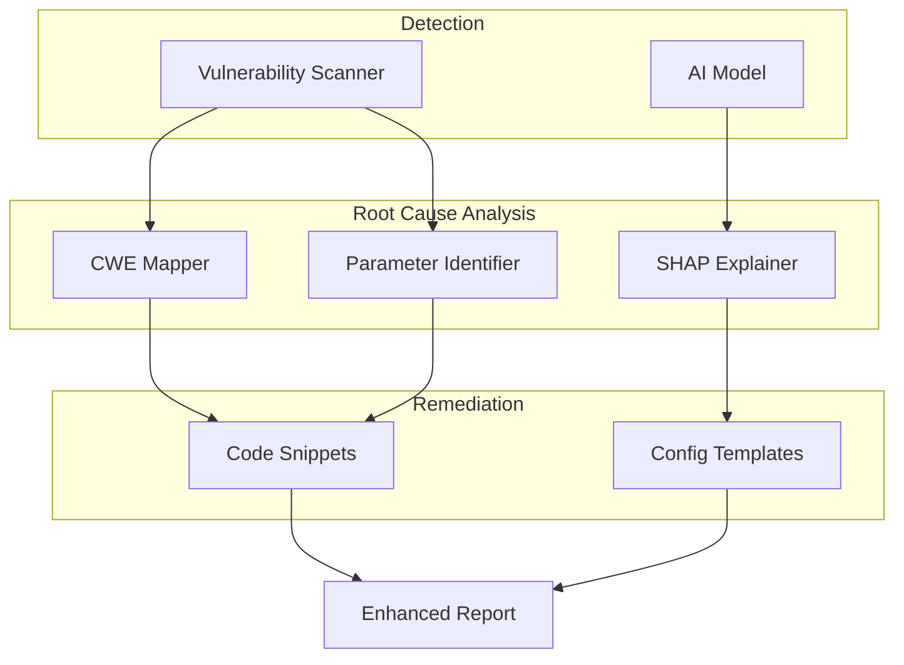

# Finding Root Cause of Vulnerabilities

> Strategies and enhancements to trace vulnerabilities back to their source.

## Current Limitation

The scanner currently **detects vulnerabilities** but doesn't identify the **root cause** - the underlying code, configuration, or architectural flaw that enabled the vulnerability.

| Current Behavior       | Desired Enhancement                        |
| ---------------------- | ------------------------------------------ |
| "SQLi detected in URL" | → Which parameter is vulnerable + code fix |
| "Missing HSTS header"  | → Server config file to modify             |
| "AI flagged anomaly"   | → Which features triggered detection       |

---

## Proposed Enhancements

### 1. CWE Mapping (Quick Win)

Map each finding to a standardized **CWE (Common Weakness Enumeration)** ID for proper categorization.

#### Implementation

```python
# Add to scanners.py
CWE_MAPPING = {
    'SQL Injection': {
        'cwe_id': 'CWE-89',
        'name': 'Improper Neutralization of Special Elements in SQL Command',
        'root_cause': 'User input directly concatenated into SQL queries',
        'fix_pattern': 'Use parameterized queries or ORM'
    },
    'Reflected XSS': {
        'cwe_id': 'CWE-79',
        'name': 'Improper Neutralization of Input During Web Page Generation',
        'root_cause': 'User input rendered in HTML without encoding',
        'fix_pattern': 'Use context-aware output encoding'
    },
    'Security Misconfiguration': {
        'cwe_id': 'CWE-693',
        'name': 'Protection Mechanism Failure',
        'root_cause': 'Security headers not configured in web server',
        'fix_pattern': 'Add headers in nginx.conf or Apache config'
    },
    'Cryptographic Failure': {
        'cwe_id': 'CWE-319',
        'name': 'Cleartext Transmission of Sensitive Information',
        'root_cause': 'HTTPS not enforced or misconfigured',
        'fix_pattern': 'Enable HTTPS and add HSTS header'
    },
    'SSRF Risk': {
        'cwe_id': 'CWE-918',
        'name': 'Server-Side Request Forgery',
        'root_cause': 'URL validation allows internal addresses',
        'fix_pattern': 'Implement allowlist for external domains'
    },
    'AI-Detected Anomaly': {
        'cwe_id': 'CWE-20',
        'name': 'Improper Input Validation',
        'root_cause': 'Unusual input pattern detected by ML model',
        'fix_pattern': 'Implement strict input validation'
    }
}
```

#### Enhanced Finding Output

```json
{
  "type": "SQL Injection",
  "affected_url": "https://example.com/search?q=test",
  "severity": "High",
  "evidence": "Error-based SQLi with payload: ' OR 1=1",
  "root_cause": {
    "cwe_id": "CWE-89",
    "cwe_name": "Improper Neutralization of SQL Command",
    "cause": "User input directly concatenated into SQL queries",
    "vulnerable_parameter": "q"
  },
  "remediation": {
    "summary": "Use parameterized queries",
    "code_example": "cursor.execute('SELECT * FROM items WHERE name = ?', (user_input,))"
  }
}
```

---

### 2. SHAP-Based AI Explainability

Use **SHAP (SHapley Additive exPlanations)** to explain why the AI model flagged a particular input.

#### Installation

```bash
pip install shap
```

#### Implementation

```python
# Add to ai_model.py
import shap

class AIInference:
    def __init__(self, model_dir=None):
        # ... existing code ...
        if self.loaded:
            self.explainer = shap.TreeExplainer(self.model)

    def explain_prediction(self, feature_dict):
        """Returns which features contributed most to the prediction."""
        df = self._prepare_features(feature_dict)
        X_scaled = self.scaler.transform(df)

        shap_values = self.explainer.shap_values(X_scaled)

        feature_names = CATEGORICAL_FEATURES + NUMERICAL_FEATURES
        contributions = list(zip(feature_names, shap_values[0]))
        contributions.sort(key=lambda x: abs(x[1]), reverse=True)

        return {
            'top_contributors': contributions[:5],
            'explanation': self._generate_explanation(contributions[:3])
        }

    def _generate_explanation(self, top_features):
        """Generate human-readable explanation."""
        explanations = {
            'sbytes': 'High source bytes suggests data exfiltration',
            'dbytes': 'High destination bytes suggests large payload delivery',
            'sttl': 'Unusual TTL may indicate spoofed packets',
            'rate': 'Abnormal packet rate suggests flood attack',
            'trans_depth': 'Deep transaction chain suggests complex attack'
        }

        parts = []
        for feature, value in top_features:
            if feature in explanations:
                parts.append(f"{explanations[feature]} (impact: {value:.2f})")

        return "; ".join(parts) if parts else "Pattern matches known attack signatures"
```

#### Sample Output

```json
{
  "type": "AI-Detected Anomaly",
  "severity": "High",
  "confidence": "96.5%",
  "root_cause": {
    "explanation": "High source bytes suggests data exfiltration (impact: 0.42); Abnormal packet rate suggests flood attack (impact: 0.31)",
    "top_contributors": [
      ["sbytes", 0.42],
      ["rate", 0.31],
      ["trans_depth", 0.15],
      ["sload", 0.08],
      ["dur", 0.04]
    ]
  }
}
```

---

### 3. Vulnerable Parameter Identification

Identify exactly which URL parameter or header is vulnerable.

#### Implementation

```python
# Enhanced test_sql_injection in scanners.py
def test_sql_injection(self, url):
    parsed = urlparse(url)
    params = parse_qs(parsed.query)

    for param_name, param_values in params.items():
        for payload in SQLI_PAYLOADS:
            test_url = self._inject_payload(url, param_name, payload)
            response = requests.get(test_url, timeout=5)

            if self._detect_sql_error(response.text):
                self.log_finding(
                    'SQL Injection',
                    url,
                    'High',
                    f"Vulnerable parameter: {param_name}",
                    root_cause={
                        'parameter': param_name,
                        'payload_type': 'error-based',
                        'original_value': param_values[0],
                        'fix': f"Sanitize '{param_name}' before SQL query"
                    }
                )
                return
```

---

### 4. Code Snippet Remediations

Provide language-specific fix examples.

```python
REMEDIATION_SNIPPETS = {
    'SQL Injection': {
        'python': '''
# Bad
cursor.execute(f"SELECT * FROM users WHERE id = {user_id}")

# Good
cursor.execute("SELECT * FROM users WHERE id = ?", (user_id,))
''',
        'javascript': '''
// Bad
db.query(`SELECT * FROM users WHERE id = ${userId}`)

// Good
db.query("SELECT * FROM users WHERE id = $1", [userId])
''',
        'php': '''
// Bad
$query = "SELECT * FROM users WHERE id = " . $_GET['id'];

// Good
$stmt = $pdo->prepare("SELECT * FROM users WHERE id = ?");
$stmt->execute([$_GET['id']]);
'''
    },
    'Reflected XSS': {
        'python': '''
# Bad (Flask)
return f"<h1>Hello {name}</h1>"

# Good (Flask)
from markupsafe import escape
return f"<h1>Hello {escape(name)}</h1>"
''',
        'javascript': '''
// Bad
element.innerHTML = userInput;

// Good
element.textContent = userInput;
'''
    }
}
```

---

### 5. Server Configuration Templates

Provide ready-to-use config fixes for misconfigurations.

```python
CONFIG_FIXES = {
    'Missing HSTS': {
        'nginx': '''
# Add to nginx.conf or site config
add_header Strict-Transport-Security "max-age=31536000; includeSubDomains" always;
''',
        'apache': '''
# Add to .htaccess or httpd.conf
Header always set Strict-Transport-Security "max-age=31536000; includeSubDomains"
'''
    },
    'Missing CSP': {
        'nginx': '''
add_header Content-Security-Policy "default-src 'self'; script-src 'self'" always;
''',
        'express': '''
// Using helmet.js
const helmet = require('helmet');
app.use(helmet.contentSecurityPolicy({
    directives: { defaultSrc: ["'self'"], scriptSrc: ["'self'"] }
}));
'''
    }
}
```

---

## Implementation Priority

| Priority | Enhancement             | Effort | Impact |
| -------- | ----------------------- | ------ | ------ |
| 🥇 1     | CWE Mapping             | Low    | High   |
| 🥈 2     | Vulnerable Parameter ID | Low    | High   |
| 🥉 3     | Remediation Snippets    | Medium | High   |
| 4        | SHAP Explainability     | Medium | Medium |
| 5        | Config Templates        | Low    | Medium |

---

## Architecture After Enhancement



---

## Next Steps

1. Choose which enhancements to implement
2. Update `scanners.py` with CWE mapping
3. Add SHAP to `ai_model.py` for explainability
4. Modify finding structure to include root cause data
5. Update frontend to display root cause information
