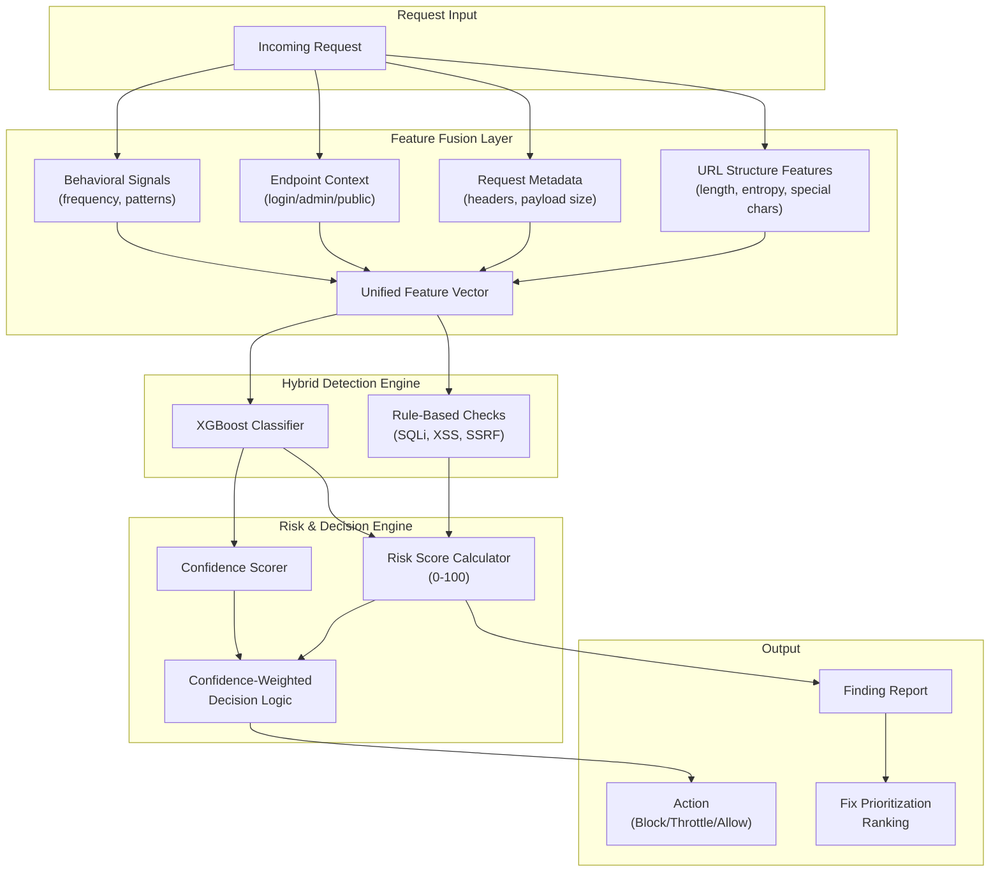

# Arhmora Architecture Enhancement: Intelligent Risk-Based Security Decision System

Transform Arhmora from a vulnerability detection tool into an intelligent, explainable, risk-based security decision system while maintaining the hybrid rule-based + XGBoost ML approach.

---

## Overview

This refactoring introduces six major architectural enhancements:

1. **Multi-Layer Feature Extraction** - Feature Fusion Layer combining URL, metadata, endpoint, and behavioral signals
2. **Behavioral Time-Window Analysis** - Sliding window tracking for distributed attack detection
3. **Confidence-Weighted Decision Logic** - Risk + confidence based actions (block/throttle/allow)
4. **Risk Scoring (0-100)** - Numerical risk scores instead of binary decisions
5. **Fix Prioritization Engine** - AI-based vulnerability remediation ranking
6. **CSIC 2010 Dataset Integration** - Enhanced URL-based attack detection with HTTP request training data

---

## Architecture Flow



---

## Proposed Changes

### Core Feature Extraction Layer

#### [NEW] [feature_extractor.py](file:///c:/Users/Aryan/OneDrive/Desktop/prj-arhmora/backend/api/scanner/feature_extractor.py)

Create a new module for multi-layer feature extraction with Feature Fusion Layer:

```python
class FeatureExtractor:
    """Multi-layer feature extraction with unified feature vector output."""

    def extract_url_features(self, url: str) -> dict:
        """Extract URL structure features: length, entropy, special chars density."""

    def extract_metadata_features(self, headers: dict, payload: bytes) -> dict:
        """Extract request metadata: header count, payload size, content type."""

    def extract_endpoint_context(self, url: str) -> dict:
        """Classify endpoint sensitivity: login, admin, api, public."""

    def get_unified_feature_vector(self, url, headers, payload) -> np.ndarray:
        """Combine all features into unified vector for AI model."""
```

**Key Features:**

- URL entropy calculation using Shannon entropy
- Special character density scoring
- Endpoint pattern matching for sensitivity classification
- Feature normalization for consistent model input

---

### Behavioral Analysis Layer

#### [NEW] [behavioral_analyzer.py](file:///c:/Users/Aryan/OneDrive/Desktop/prj-arhmora/backend/api/scanner/behavioral_analyzer.py)

Create a new module for time-window based behavioral analysis:

```python
class BehavioralAnalyzer:
    """Sliding window behavioral analysis for distributed attack detection."""

    WINDOW_SIZE = 300  # 5 minutes

    def __init__(self):
        self.request_cache = {}  # In-memory or Redis-backed

    def record_request(self, source_ip: str, url: str, timestamp: float) -> None:
        """Record request in sliding window for source tracking."""

    def get_behavioral_metrics(self, source_ip: str) -> dict:
        """Get behavioral metrics: frequency, repetition rate, pattern score."""

    def detect_anomalies(self, source_ip: str) -> dict:
        """Detect abnormal frequency or repetition patterns."""
```

**Key Features:**

- Per-source sliding window request tracking
- Request frequency calculation (requests per minute)
- URL repetition detection (same endpoint hit rate)
- Burst detection (rapid consecutive requests)

---

### Enhanced AI Engine

#### [MODIFY] [ai_model.py](file:///c:/Users/Aryan/OneDrive/Desktop/prj-arhmora/backend/api/scanner/ai_model.py)

Update `AIInference` class to output both risk score and confidence:

```diff
class AIInference:
    def predict(self, feature_dict) -> dict:  # Changed return type
        """
        Returns:
            dict: {
                'probability': float,
                'confidence': float,  # NEW: Model confidence
                'risk_score': int,    # NEW: 0-100 risk score
            }
        """

-   def calculate_severity(self, probability):
+   def calculate_severity(self, risk_score: int, confidence: float) -> str:
        """Confidence-aware severity calculation."""

+   def should_block(self, risk_score: int, confidence: float) -> bool:
        """Block only if HIGH risk AND confidence > threshold."""
```

**Key Changes:**

- Add confidence score extraction from XGBoost prediction margins
- Convert probability to 0-100 risk score
- Implement configurable confidence threshold for blocking
- Add decision action determination (block/throttle/allow)

---

### Fix Prioritization Engine

#### [NEW] [fix_prioritizer.py](file:///c:/Users/Aryan/OneDrive/Desktop/prj-arhmora/backend/api/scanner/fix_prioritizer.py)

Create AI-based fix prioritization module:

```python
class FixPrioritizer:
    """Rank vulnerabilities for remediation priority."""

    EFFORT_ESTIMATES = {
        'Security Misconfiguration': 1,  # Easy
        'Missing Headers': 1,
        'SQL Injection': 3,              # Hard
        'XSS': 2,                         # Medium
        # ... more mappings
    }

    def calculate_priority_score(self, finding: dict) -> float:
        """Calculate priority based on severity, confidence, endpoint sensitivity, effort."""

    def rank_findings(self, findings: list) -> list:
        """Return findings ordered by remediation priority."""
```

**Priority Score Formula:**

```
priority = (severity_weight * 3) + (confidence * 2) + (endpoint_sensitivity * 2) - (fix_effort * 0.5)
```

---

### Database Schema Updates

#### [MODIFY] [models.py](file:///c:/Users/Aryan/OneDrive/Desktop/prj-arhmora/backend/api/models.py)

Update `ScanFinding` model with new fields:

```diff
class ScanFinding(models.Model):
    SEVERITY_CHOICES = [
        ('Low', 'Low'),
        ('Medium', 'Medium'),
        ('High', 'High'),
    ]

    scan = models.ForeignKey(ScanHistory, on_delete=models.CASCADE, related_name='findings')
    v_type = models.CharField(max_length=100)
    severity = models.CharField(max_length=20, choices=SEVERITY_CHOICES)
    affected_url = models.URLField()
    evidence = models.TextField()
    remediation = models.TextField()

+   # New fields for enhanced architecture
+   risk_score = models.IntegerField(default=0)  # 0-100 numerical score
+   confidence = models.FloatField(default=0.0)  # AI confidence 0.0-1.0
+   priority_rank = models.IntegerField(null=True)  # Remediation priority
+   endpoint_sensitivity = models.CharField(max_length=20, default='public')
+   action_taken = models.CharField(max_length=20, default='flagged')  # block/throttle/allow/flagged
```

#### [NEW] RequestLog Model for Behavioral Tracking

```python
class RequestLog(models.Model):
    """Track requests for behavioral analysis (sliding window)."""
    source_ip = models.GenericIPAddressField()
    target_url = models.URLField()
    timestamp = models.DateTimeField(auto_now_add=True)
    request_hash = models.CharField(max_length=64)  # For pattern detection

    class Meta:
        indexes = [
            models.Index(fields=['source_ip', 'timestamp']),
        ]
```

---

### Scanner Integration

#### [MODIFY] [scanners.py](file:///c:/Users/Aryan/OneDrive/Desktop/prj-arhmora/backend/api/scanner/scanners.py)

Update `VulnerabilityScanner` to use new components:

```diff
class VulnerabilityScanner:
    def __init__(self, target_url):
        self.target_url = target_url
        self.domain = urlparse(target_url).netloc
        self.findings = []

        model_dir = os.path.dirname(os.path.abspath(__file__))
        self.ai_engine = AIInference(model_dir=model_dir)
+       self.feature_extractor = FeatureExtractor()
+       self.prioritizer = FixPrioritizer()

-   def log_finding(self, v_type, url, severity, evidence, remediation):
+   def log_finding(self, v_type, url, severity, evidence, remediation,
+                   risk_score=0, confidence=0.0, explanation=None, action='flagged'):
        self.findings.append({
            'type': v_type,
            'affected_url': url,
            'severity': severity,
            'evidence': evidence,
            'remediation': remediation,
+           'risk_score': risk_score,
+           'confidence': confidence,
+           'action_taken': action
        })

+   def run_scans(self, crawled_data):
+       # ... existing scans ...
+
+       # After all scans, prioritize findings
+       self.findings = self.prioritizer.rank_findings(self.findings)
+       return self.findings
```

---

### API Response Updates

#### [MODIFY] [serializers.py](file:///c:/Users/Aryan/OneDrive/Desktop/prj-arhmora/backend/api/serializers.py)

Update `ScanFindingSerializer` with new fields:

```diff
class ScanFindingSerializer(serializers.ModelSerializer):
    class Meta:
        model = ScanFinding
        fields = [
            'id', 'v_type', 'severity', 'affected_url',
            'evidence', 'remediation',
+           'risk_score', 'confidence',
+           'priority_rank', 'endpoint_sensitivity', 'action_taken'
        ]
```

---

## Configuration

#### [NEW] [scanner_config.py](file:///c:/Users/Aryan/OneDrive/Desktop/prj-arhmora/backend/api/scanner/scanner_config.py)

Centralized configuration for the enhanced architecture:

```python
# Confidence thresholds for decision logic
BLOCK_CONFIDENCE_THRESHOLD = 0.85
HIGH_RISK_THRESHOLD = 80  # Risk score 0-100
MEDIUM_RISK_THRESHOLD = 50

# Behavioral analysis settings
SLIDING_WINDOW_SECONDS = 300  # 5 minutes
FREQUENCY_ANOMALY_THRESHOLD = 60  # requests per minute
REPETITION_ANOMALY_THRESHOLD = 0.7  # 70% same endpoint

# Endpoint sensitivity patterns
SENSITIVE_ENDPOINTS = {
    'admin': ['admin', 'administrator', 'manage', 'control'],
    'auth': ['login', 'signin', 'auth', 'oauth', 'password', 'reset'],
    'api': ['api', 'graphql', 'rest', 'webhook'],
    'data': ['export', 'download', 'backup', 'database'],
}
```

---

## CSIC 2010 Dataset Integration

The CSIC 2010 HTTP Dataset is a benchmark dataset for web attack detection containing ~36,000 labeled HTTP requests (normal vs anomalous). This integration will significantly improve URL-based attack detection accuracy.

### Dataset Overview

| Property     | Value                                               |
| ------------ | --------------------------------------------------- |
| **Source**   | Spanish Research Council (CSIC)                     |
| **Format**   | HTTP request logs (text files)                      |
| **Size**     | ~36,000 requests                                    |
| **Classes**  | Normal, Anomalous (SQLi, XSS, Path Traversal, etc.) |
| **Download** | [CSIC 2010](http://www.isi.csic.es/dataset/)        |

### Data Preparation

#### [NEW] [data/csic2010/](file:///c:/Users/Aryan/OneDrive/Desktop/prj-arhmora/data/csic2010/)

Create directory structure for dataset:

```
data/
├── csic2010/
│   ├── normalTrafficTraining.txt    # Normal HTTP requests
│   ├── normalTrafficTest.txt        # Normal test set
│   ├── anomalousTrafficTest.txt     # Attack HTTP requests
│   └── processed/
│       └── csic_features.csv        # Extracted features
```

#### [NEW] [csic_loader.py](file:///c:/Users/Aryan/OneDrive/Desktop/prj-arhmora/backend/api/scanner/csic_loader.py)

Dataset loader and feature extraction for CSIC 2010:

```python
import re
import pandas as pd
from urllib.parse import urlparse, parse_qs
import math

class CSICDataLoader:
    """Load and preprocess CSIC 2010 HTTP Dataset."""

    def __init__(self, data_dir: str):
        self.data_dir = data_dir

    def parse_http_request(self, request_text: str) -> dict:
        """Parse raw HTTP request into structured features."""
        lines = request_text.strip().split('\n')

        # Extract method, URL, HTTP version from first line
        first_line = lines[0].split()
        method = first_line[0] if len(first_line) > 0 else ''
        url = first_line[1] if len(first_line) > 1 else ''

        # Extract headers
        headers = {}
        body = ''
        is_body = False
        for line in lines[1:]:
            if line.strip() == '':
                is_body = True
                continue
            if is_body:
                body += line
            elif ':' in line:
                key, value = line.split(':', 1)
                headers[key.strip()] = value.strip()

        return {
            'method': method,
            'url': url,
            'headers': headers,
            'body': body,
            'header_count': len(headers),
            'body_length': len(body)
        }

    def extract_url_features(self, url: str) -> dict:
        """Extract numerical features from URL for ML model."""
        parsed = urlparse(url)
        path = parsed.path
        query = parsed.query

        # Calculate Shannon entropy
        def entropy(s):
            if not s:
                return 0.0
            prob = [s.count(c) / len(s) for c in set(s)]
            return -sum(p * math.log2(p) for p in prob if p > 0)

        # Special character counts
        special_chars = set('@#$%^&*()+=[]{}|\\<>?`~')
        sql_chars = set("'\"=-;")
        xss_chars = set('<>()/')

        return {
            'url_length': len(url),
            'path_length': len(path),
            'query_length': len(query),
            'path_depth': path.count('/'),
            'param_count': len(parse_qs(query)),
            'url_entropy': entropy(url),
            'special_char_count': sum(1 for c in url if c in special_chars),
            'special_char_ratio': sum(1 for c in url if c in special_chars) / max(len(url), 1),
            'sql_char_count': sum(1 for c in url if c in sql_chars),
            'xss_char_count': sum(1 for c in url if c in xss_chars),
            'digit_ratio': sum(1 for c in url if c.isdigit()) / max(len(url), 1),
            'uppercase_ratio': sum(1 for c in url if c.isupper()) / max(len(url), 1),
            'has_encoded_chars': 1 if '%' in url else 0,
            'double_slash_count': url.count('//'),
            'dot_count': url.count('.'),
        }

    def load_dataset(self) -> pd.DataFrame:
        """Load all CSIC files and create feature DataFrame."""
        records = []

        # Load normal traffic (label = 0)
        for filename in ['normalTrafficTraining.txt', 'normalTrafficTest.txt']:
            filepath = f"{self.data_dir}/{filename}"
            requests = self._split_requests(filepath)
            for req in requests:
                parsed = self.parse_http_request(req)
                features = self.extract_url_features(parsed['url'])
                features['method'] = parsed['method']
                features['header_count'] = parsed['header_count']
                features['body_length'] = parsed['body_length']
                features['label'] = 0  # Normal
                records.append(features)

        # Load anomalous traffic (label = 1)
        filepath = f"{self.data_dir}/anomalousTrafficTest.txt"
        requests = self._split_requests(filepath)
        for req in requests:
            parsed = self.parse_http_request(req)
            features = self.extract_url_features(parsed['url'])
            features['method'] = parsed['method']
            features['header_count'] = parsed['header_count']
            features['body_length'] = parsed['body_length']
            features['label'] = 1  # Attack
            records.append(features)

        return pd.DataFrame(records)

    def _split_requests(self, filepath: str) -> list:
        """Split file into individual HTTP requests."""
        with open(filepath, 'r', encoding='utf-8', errors='ignore') as f:
            content = f.read()
        # CSIC uses double newlines to separate requests
        return [r.strip() for r in content.split('\n\n') if r.strip()]
```

### Model Training Update

#### [MODIFY] [ai_model.py](file:///c:/Users/Aryan/OneDrive/Desktop/prj-arhmora/backend/api/scanner/ai_model.py)

Add CSIC 2010 training pipeline alongside existing UNSW-NB15:

```python
# Add new URL-focused model training
CSIC_DATA_DIR = os.path.join(ROOT_DIR, 'data', 'csic2010')
URL_MODEL_PATH = os.path.join(BASE_DIR, 'models', 'url_attack_model.pkl')
URL_SCALER_PATH = os.path.join(BASE_DIR, 'models', 'url_scaler.pkl')

URL_FEATURES = [
    'url_length', 'path_length', 'query_length', 'path_depth',
    'param_count', 'url_entropy', 'special_char_count', 'special_char_ratio',
    'sql_char_count', 'xss_char_count', 'digit_ratio', 'uppercase_ratio',
    'has_encoded_chars', 'double_slash_count', 'dot_count',
    'header_count', 'body_length'
]

def train_url_model():
    """Train XGBoost model on CSIC 2010 HTTP dataset for URL attack detection."""
    from .csic_loader import CSICDataLoader

    print("Loading CSIC 2010 dataset...")
    loader = CSICDataLoader(CSIC_DATA_DIR)
    df = loader.load_dataset()

    # Encode method (categorical)
    method_encoder = LabelEncoder()
    df['method_encoded'] = method_encoder.fit_transform(df['method'].astype(str))

    features = URL_FEATURES + ['method_encoded']
    X = df[features]
    y = df['label']

    X_train, X_test, y_train, y_test = train_test_split(X, y, test_size=0.2, random_state=42)

    # Scale numerical features
    scaler = StandardScaler()
    X_train_scaled = scaler.fit_transform(X_train)
    X_test_scaled = scaler.transform(X_test)

    print(f"Training URL attack model on {len(X_train)} samples...")

    model = XGBClassifier(
        n_estimators=150,
        learning_rate=0.1,
        max_depth=5,
        subsample=0.8,
        colsample_bytree=0.8,
        n_jobs=-1,
        random_state=42,
        eval_metric='logloss'
    )

    model.fit(X_train_scaled, y_train)

    # Evaluation
    y_pred = model.predict(X_test_scaled)
    print(f"URL Model Accuracy: {accuracy_score(y_test, y_pred):.4f}")
    print("\nClassification Report:")
    print(classification_report(y_test, y_pred, target_names=['Normal', 'Attack']))

    # Save artifacts
    joblib.dump(model, URL_MODEL_PATH)
    joblib.dump(scaler, URL_SCALER_PATH)
    joblib.dump(method_encoder, os.path.join(BASE_DIR, 'models', 'url_method_encoder.pkl'))
    print(f"URL attack model saved to {URL_MODEL_PATH}")
```

### Update AIInference for Dual-Model Prediction

```python
class AIInference:
    def __init__(self, model_dir=None):
        # ... existing NIDS model loading ...

        # Load URL attack model (CSIC-trained)
        url_model_path = os.path.join(model_dir, 'url_attack_model.pkl')
        url_scaler_path = os.path.join(model_dir, 'url_scaler.pkl')

        if os.path.exists(url_model_path):
            self.url_model = joblib.load(url_model_path)
            self.url_scaler = joblib.load(url_scaler_path)
            self.url_model_loaded = True
        else:
            self.url_model_loaded = False

    def predict_url_attack(self, url: str, headers: dict = None) -> dict:
        """Predict URL attack probability using CSIC-trained model."""
        if not self.url_model_loaded:
            return {'probability': 0.0, 'confidence': 0.0, 'risk_score': 0}

        # Extract features using same logic as CSICDataLoader
        features = self._extract_url_features(url)
        features['header_count'] = len(headers) if headers else 0
        features['body_length'] = 0
        features['method_encoded'] = 0  # Default to GET

        # Create feature vector in correct order
        X = pd.DataFrame([features])[URL_FEATURES + ['method_encoded']]
        X_scaled = self.url_scaler.transform(X)

        # Get prediction with probability
        prob = self.url_model.predict_proba(X_scaled)[0][1]

        # Calculate confidence from prediction margin
        confidence = abs(prob - 0.5) * 2  # 0.0 to 1.0

        # Convert to risk score (0-100)
        risk_score = int(prob * 100)

        return {
            'probability': float(prob),
            'confidence': float(confidence),
            'risk_score': risk_score
        }
```

### Training Commands

After downloading the CSIC 2010 dataset:

```bash
# 1. Create data directory
mkdir -p c:\Users\Aryan\OneDrive\Desktop\prj-arhmora\data\csic2010

# 2. Download dataset files to data/csic2010/
# - normalTrafficTraining.txt
# - normalTrafficTest.txt
# - anomalousTrafficTest.txt

# 3. Train the URL attack model
cd c:\Users\Aryan\OneDrive\Desktop\prj-arhmora\backend
python -c "from api.scanner.ai_model import train_url_model; train_url_model()"
```

### Expected Model Performance

Based on CSIC 2010 benchmarks:

| Metric             | Expected Value |
| ------------------ | -------------- |
| Accuracy           | ~96-98%        |
| Precision (Attack) | ~95%           |
| Recall (Attack)    | ~97%           |
| F1-Score           | ~96%           |

> [!NOTE]
> The CSIC-trained URL model complements the UNSW-NB15 NIDS model. The system will use **both models** for comprehensive detection: NIDS for network-level anomalies and URL model for application-layer attacks.

---

## Verification Plan

### Automated Tests

The project has existing test files in `backend/tests/`. We will add new tests:

#### 1. Unit Tests for New Modules

Run all unit tests:

```bash
cd c:\Users\Aryan\OneDrive\Desktop\prj-arhmora\backend
python -m pytest tests/ -v
```

New test files to create:

- `tests/test_feature_extractor.py` - Test URL feature extraction
- `tests/test_behavioral_analyzer.py` - Test sliding window logic
- `tests/test_explainer.py` - Test explanation generation
- `tests/test_fix_prioritizer.py` - Test priority ranking

#### 2. Integration Tests

Test the complete scan pipeline with new features:

```bash
cd c:\Users\Aryan\OneDrive\Desktop\prj-arhmora\backend
python -c "
from api.scanner.scanners import VulnerabilityScanner
from api.scanner.crawler import Crawler

# Test with sample URL
scanner = VulnerabilityScanner('https://example.com')
crawler = Crawler('https://example.com', max_pages=5)
crawled = crawler.crawl()
findings = scanner.run_scans(crawled)

# Verify new fields exist
for f in findings:
    print(f'Risk Score: {f.get(\"risk_score\", \"MISSING\")}')
    print(f'Confidence: {f.get(\"confidence\", \"MISSING\")}')
    print(f'Priority: {f.get(\"priority_rank\", \"MISSING\")}')
    print('---')
"
```

#### 3. Database Migration Test

```bash
cd c:\Users\Aryan\OneDrive\Desktop\prj-arhmora\backend
python manage.py makemigrations --dry-run
python manage.py migrate
```

### Manual Verification

1. **Start the backend server:**

   ```bash
   cd c:\Users\Aryan\OneDrive\Desktop\prj-arhmora\backend
   python manage.py runserver
   ```

2. **Trigger a scan via API** (using authenticated request):

   ```
   POST /api/scan/
   Body: {"target_url": "https://testphp.vulnweb.com"}
   ```

3. **Retrieve scan results and verify:**
   - `risk_score` field (0-100)
   - `confidence` field (0.0-1.0)
   - `priority_rank` ordering
   - `action_taken` value (block/throttle/allow/flagged)

---

## Summary of New Files

| File                     | Purpose                                    |
| ------------------------ | ------------------------------------------ |
| `feature_extractor.py`   | Multi-layer feature extraction with fusion |
| `behavioral_analyzer.py` | Sliding window behavioral analysis         |
| `fix_prioritizer.py`     | AI-based remediation priority ranking      |
| `scanner_config.py`      | Centralized configuration constants        |
| `csic_loader.py`         | CSIC 2010 dataset loader and preprocessor  |

## Modified Files

| File             | Changes                                      |
| ---------------- | -------------------------------------------- |
| `ai_model.py`    | Confidence scoring, risk calculation         |
| `scanners.py`    | Integration with new modules                 |
| `models.py`      | New fields for ScanFinding, RequestLog model |
| `serializers.py` | New fields in API responses                  |
| `tasks.py`       | Updated finding creation with new fields     |

---

> [!IMPORTANT]
> This architecture maintains the existing XGBoost model and rule-based detection. No deep learning replacements are made. All changes are modular and compatible with the existing Django app structure.
